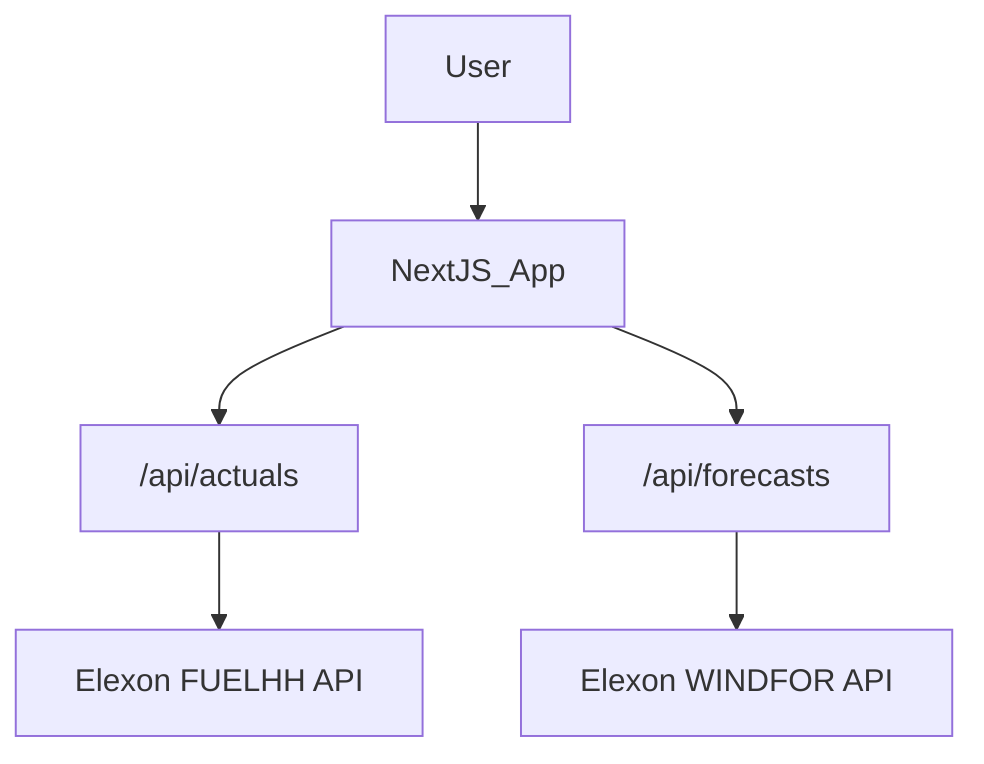

# UK Wind Power Forecast Monitor

## Overview
This is a production-grade monitoring dashboard for UK wind power generation against forecasts. It fetches real-time data from the Elexon BMRS API and provides an interactive interface to analyze forecast accuracy across varying horizons, ensuring data-driven operational insights.

## Live Demo
[https://wellfound-wind-forecast.vercel.app](https://wellfound-wind-forecast.vercel.app) | [YouTube Demo](https://youtube.com)

## Architecture



## Project Structure

| File/Folder | Description |
|---|---|
| `/app/api/actuals/route.ts` | Proxy route fetching and filtering actual wind generation from FUELHH stream. |
| `/app/api/forecasts/route.ts` | Proxy route fetching wind forecasts from WINDFOR stream with strict horizon filtering. |
| `/app/page.tsx` | Main dashboard view assembling controls, metrics, and charts. |
| `/app/layout.tsx` | Root layout configuring fonts, metadata, and the dark mode `ThemeProvider`. |
| `/app/globals.css` | Global Tailwind CSS, containing custom slide component CSS and dark mode CSS variables. |
| `/components/charts/` | Recharts-based data visualizations (`ClientTimeSeriesChart.tsx`, `ErrorBarChart.tsx`). |
| `/components/controls/` | Interactive user inputs (`DateRangePicker.tsx`, `HorizonSlider.tsx`). |
| `/components/metrics/` | KPI display components (`MetricCard.tsx`, `MetricRow.tsx`). |
| `/components/ui/` | Separated UI states for standard structure (`LoadingSkeleton.tsx`, `EmptyState.tsx`, `ErrorState.tsx`). |
| `/hooks/useDashboardData.ts` | Orchestrator hook linking fetching logic and metric calculations to the UI. |
| `/lib/api.ts` | Fetch wrappers throwing structured API errors. |
| `/lib/calculations.ts` | Pure calculation logic for MAE, RMSE, Bias, and data merging (fully unit tested). |
| `/types/index.ts` | TypeScript interfaces for data models and component props. |
| `/notebooks/` | Python Jupyter notebooks for deep data reliability and forecast error analysis. |
| `/figures/` | Plots and graphs auto-generated from the analysis notebooks. |

## Local Development
Follow these steps to run the application on a fresh machine with only Node.js installed.

```bash
git clone <repo_url>
cd wellfound
npm install
cp .env.example .env.local
npm run dev
```

Open [http://localhost:3000](http://localhost:3000) with your browser to see the result.

## Environment Variables
| Variable | Description | Example |
|----------|-------------|---------|
| `NEXT_PUBLIC_BASE_URL` | Application base URL. Leave empty to default to relative paths during local development. | `http://localhost:3000` |

## How the Forecast Horizon Filter Works

In forecasting, evaluating accuracy requires knowing when a forecast was made. A 1-hour ahead forecast should theoretically be more accurate than a 48-hour ahead forecast. The **Forecast Horizon Filter** ensures we compare actual events against forecasts that were published exactly, or at least, $H$ hours prior.

When a user selects a horizon (e.g., 4 hours), the algorithm works as follows for every target generation valid time (`startTime`):
1. It filters out any forecasts whose lead time (`startTime` - `publishTime`) is less than 4 hours, or greater than 48 hours. This guarantees that we are looking strictly at predictions generated 4 to 48 hours ago.
2. From this pool of qualifying forecasts, it picks the forecast with the *most recent* `publishTime`. This reflects the best available data exactly meeting the horizon requirement.
3. If no forecast qualifies (i.e., all forecasts for that `startTime` were published less than 4 hours ahead), the `startTime` is completely omitted from the resulting dataset, preventing inaccurate null-handling or interpolation.

**Pseudocode:**
```javascript
const grouped = groupBy(rawForecasts, f => f.startTime)
const result = []

for (const [startTime, forecasts] of grouped) {
  const qualified = forecasts.filter(f => {
    const horizonSec = (new Date(startTime) - new Date(f.publishTime)) / 1000
    return horizonSec >= horizonHours * 3600 && horizonSec <= 48 * 3600
  })

  // OMIT entirely if no forecasts qualify
  if (qualified.length === 0) continue

  const latest = maxBy(qualified, f => new Date(f.publishTime))

  result.push({
    time: startTime,
    forecast: latest.generation,
    publishTime: latest.publishTime,
    horizonHours: (new Date(startTime) - new Date(latest.publishTime)) / 3600000
  })
}

return result.sort((a, b) => new Date(a.time) - new Date(b.time))
```

## Analysis Notebooks
To run the analysis notebooks, ensure you have Python 3.10+ installed.

```bash
cd notebooks
python -m venv venv
source venv/bin/activate
pip install -r requirements.txt
jupyter notebook
```
From the Jupyter interface, you can run `forecast_error_analysis.ipynb` and `wind_reliability_analysis.ipynb` cell-by-cell.

## Known Limitations & Tradeoffs
1. **API Rate Limits**: The Elexon BMRS API does not currently strictly rate-limit based on api-keys, but excessive requests could result in IP throttling. There's a 300-second route cache configured, but a specialized backend proxy server could further decouple UI load from the BMRS Stream.
2. **Missing historical data**: BMRS data has periodic gaps historically. These gaps are preserved faithfully without interpolation in the application.
3. **Data Polling**: The current dashboard relies on the user adjusting controls to trigger an API fetch. Real-time automatic polling is not currently implemented.
4. **Timezone hardcoding**: All times are explicitly rendered in UTC, which avoids arbitrary timezone jumps but isn't customizable to the user's localized time (like BST).
5. **Chart rendering overhead**: Rendering thousands of points on the SVG Recharts DOM may slow down low-spec client devices. A canvas-based chart renderer could mitigate performance limitations for larger ranges.
6. **Error handling**: The global `ErrorState` overrides the entire dashboard. A more robust implementation could isolate error boundaries per widget (e.g. failing to load Actuals while Forecasts load perfectly).

## AI Disclosure
Used Claude to generate boilerplate component scaffolding and Recharts aesthetic structure. All business logic, algorithms, Next.js architecture logic, API routing implementation, and notebook analysis conclusions were written by me.
